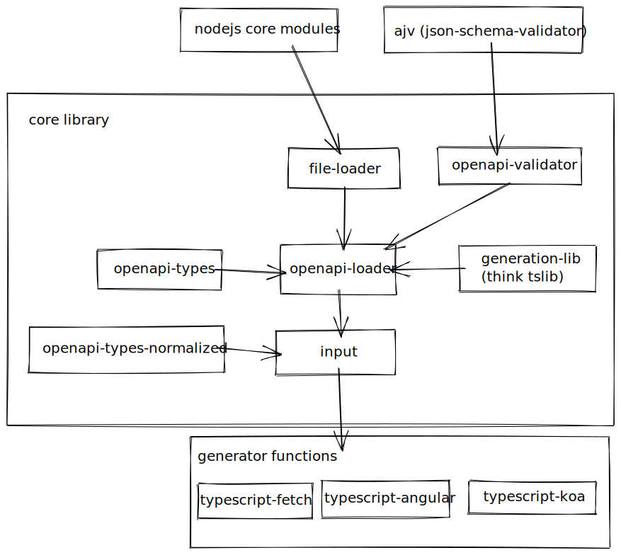

# openapi-code-generator
**Status:** Early, experimental. Not yet published to NPM.

However, as shown by the integration tests, a fair job of generating a typed client
is achieved for even fairly large/complex definitions like the GitHub api. The koa
generation is less refined.

## Goal
To make it fun, easy and productive to generate both client and server "glue" 
code from openapi 3 definitions.

Additionally, the code output should be "stable" in the sense that it will not
arbitrarily change between generation without need (for a given version). For 
example outputting entities in alphabetic order where possible. The intent
is that the generated code can and should be committed to the consuming project
repositories, allowing it to be eyeballed, and audited overtime.

The initial focus on typescript, but nothing in the core of the library is assuming this.

## Build
Refer to [package.json](package.json) `scripts` for pointers on building / testing.

## CLI Usage
Usage like so:
```shell
node ../../packages/openapi-code-generator/dist/index.js \
    --input="./my-openapi-file.yaml" \
    --output="./src/$filename" \
    --template=typescript-koa
```

Where template is one of:
- typescript-angular
- typescript-fetch
- typescript-koa

## Architecture
The project is still evolving dramatically, but this should give a good overview 
of the current approach



### `./packages/openapi-code-generator/src/core`
This contains the generator/target language agnostic parts of the project.

The process of generation resembles a pipeline in many ways

#### `file-loader`
does what it says on the tin, given a path/uri it reads in the file and parses it from json/yaml
**(http support todo)**

#### `openapi-validator`
nothing particular interesting here, just takes a loaded document and validates it against
the openapi3 specification in json schema format.

Useful for detecting emission errors due to bad input rather than bugs in the code generation.

#### `openapi-loader`
`openapi-loader` takes an entrypoint path, and loads + validates a collection of files .

It then provides typed access to the raw openapi structures, with methods able to convert 
"maybe refs" into the referenced objects.

This is important because one of the more painful (and bug prone) parts of parsing openapi 
documents is correctly following $ref's, as you need to carry around the context of which
document you came from.

The `openapi-loader` makes this much less complicated by loading all files up front, and normalizing
the contained $ref to absolute paths.

#### `input`
Ultimately an instance of the `input` class is passed to a generator.

The goal of the `input` class is to provide ergonomic, target language agnostic access to
the openapi documents given as input to the generator.

It primarily surfaces api operations, with optional grouping strategies, as a normalized type
that has already de-referenced parameters / responses, and set default values on various properties.

### ./packages/openapi-code-generator/src/typescript
This contains the various typescript generator functions. Each generator currently has a simple
signature:

```typescript
export interface OpenapiGenerator {
  (args: { dest: string, input: Input }): Promise<void>
}
```

Where `dest` is a path to a directory to emit code into, and `Input` is an initialized instance
of the `Input` class described above.

You can find all registered generators in `templates.ts` - eventually this likely be split into
packages that consume the core modules.
