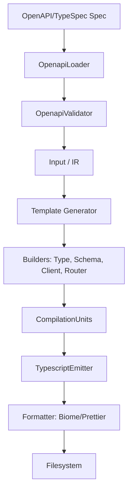

# Architecture

This document describes the high-level architecture, package structure, and common patterns of the `@nahkies/openapi-code-generator` monorepo.

## High-Level Overview

`@nahkies/openapi-code-generator` is a monorepo that produces a CLI tool for generating TypeScript client SDKs and server scaffolding from OpenAPI 3.0, 3.1, and TypeSpec specifications.

The system follows a typical compiler/generator pipeline:
1.  **Loading**: Specifications are loaded and resolved (including remote/local references).
2.  **Validation**: Loaded specifications are validated against their respective schemas using pre-compiled AJV validators.
3.  **Normalization**: The specification is transformed into a normalized Intermediate Representation (IR).
4.  **Building**: Template-specific builders transform the IR into code structures (types, schemas, clients/routers).
5.  **Emission**: The generated structures are formatted and written to the file system.

## Package Structure

- **`packages/openapi-code-generator`**: The core package containing the CLI, loader logic, IR normalization, and code generation templates.
- **`packages/typescript-common-runtime`**: Shares common types (e.g., `Res`, `StatusCode`) and utilities (e.g., query parsing, body validation) used by all generated TypeScript code.
- **`packages/typescript-*-runtime`**: Runtime-specific support packages.
    - `typescript-axios-runtime`: Provides utilities for Axios clients.
    - `typescript-fetch-runtime`: Provides `AbstractFetchClient`.
    - `typescript-express-runtime`: Provides utilities for routing and response handling in Express.
    - `typescript-koa-runtime`: Provides utilities for routing and response handling in Koa.
- **`integration-tests`**: Validates the generator by running it against real-world specifications (Github, Stripe, etc.) and ensuring the output compiles.
- **`e2e`**: End-to-end tests for the CLI and generated code.

## Core Patterns

### Adaptor Pattern
The generator uses adaptors to abstract environment-specific logic, allowing it to run in both Node.js and the browser (playground).
- **`IFsAdaptor`**: Abstraction for file system operations (`NodeFsAdaptor`, `WebFsAdaptor`).
- **`IFormatter`**: Abstraction for code formatting (`TypescriptFormatterPrettier`, `TypescriptFormatterBiome`).

### Builder Pattern
Complex code generation is managed through builders that accumulate state and then produce a `CompilationUnit`.
- **`TypeBuilder`**: Generates TypeScript type definitions.
- **`SchemaBuilder`**: Generates runtime validation schemas (Joi or Zod).
- **`ClientBuilder`**: (e.g., `TypescriptFetchClientBuilder`) Generates client-side SDK code.
- **`RouterBuilder` / `ServerBuilder`**: (e.g., `ExpressRouterBuilder`, `ExpressServerBuilder`) Generates server-side scaffolding and routing.

### Compilation Units
A `CompilationUnit` (defined in `packages/openapi-code-generator/src/typescript/common/compilation-units.ts`) represents a single file to be emitted. It encapsulates:
- The target filename.
- An `ImportBuilder` to manage required imports without duplicates.
- The raw string of code.

### Intermediate Representation (IR)
The `Input` class (in `src/core/input.ts`) serves as the IR. It takes a raw loader and provides normalized access to operations, schemas, and servers. This decoupling ensures that templates don't need to handle OpenAPI version differences or complex reference resolution.

## Data Flow

## Important Invariants & Conventions

### Invariants
- **No `npx`**: Always use `pnpm run` or `pnpm exec`.
- **Read-Only Generation**: Never manually edit files in `src/generated/` directories; they are overwritten during generation.
- **Vitest Globals**: Always explicitly import vitest globals (`describe`, `it`, `expect`) from `vitest`.

### Conventions
- **Co-location**: Unit tests (`*.spec.ts`) are co-located with the source code they test. Use explicit vitest imports (`import {describe, it, expect} from "vitest"`).
- **Import Extensions**: Use `.ts` extensions in imports (e.g., `import {foo} from "./foo.ts"`) to support ESM.
- **Dependency Migration**: Prefer `pnpm` workspace references (e.g., `"@nahkies/typescript-common-runtime": "workspace:*"`).

## How to add a new feature

1.  **Identify the Stage**: Determine if the change belongs in the `Loader`, `Input` (IR), or a specific `Generator`/`Builder`.
2.  **Update IR (if needed)**: If the feature requires new data from the OpenAPI spec, update `src/core/openapi-types-normalized.ts` and the normalization logic in `src/core/input.ts`.
3.  **Update Builders**: Implement the code generation logic in the relevant builders (e.g., `ClientOperationBuilder`).
4.  **Add Unit Tests**: Add a `.spec.ts` next to the modified file.
5.  **Add Integration Spec**: If the feature is a new OpenAPI concept, add a minimal reproduction spec to `integration-tests-definitions`.
6.  **Run Pipeline**: 
    - `pnpm build`
    - `pnpm integration:generate`
    - `pnpm integration:validate`
7.  **Documentation**: Update the external documentation in `packages/documentation` if user-facing.

## Common Gotchas

- **Cyclic Dependencies**: When generating schemas (Joi/Zod), the generator must handle cyclic references in the OpenAPI spec. Check `SchemaBuilder`'s handling of `Reference`. For Zod, we have multiple versions (`zod-v3`, `zod-v4`) as Zod v4 handles lazy schemas differently.
- **Filename Casing**: The generator supports different filename conventions. Ensure your builders respect `config.filenameConvention`.
- **ESM vs CJS**: The project targets ESM. Relative imports must include file extensions.
- **Generated Schema Validators**: `src/core/schemas/openapi-*-specification-validator.js` are generated. If you update the meta-schemas, you must run the build script to refresh them.

## Anti-Patterns

- **Direct Spec Access**: Avoid accessing the raw `Loader` or `loader.entryPoint` from within template builders. Use the normalized `Input` (IR) instead.
- **Hardcoded Filenames**: Avoid hardcoding filenames in builders; use the provided config and `ImportBuilder` to manage paths.
- **Complex Logic in Templates**: `*.generator.ts` files should be orchestrators. Move complex logic into dedicated `Builder` classes (e.g. `ClientOperationBuilder` or `SchemaBuilder`).
