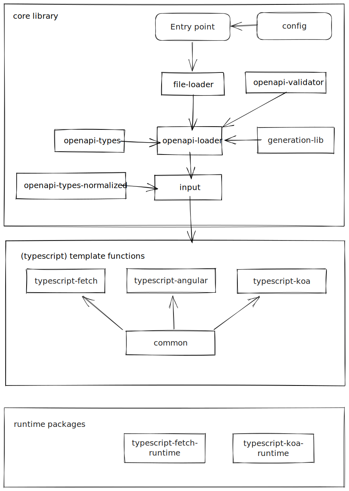

# Architecture

The project is still evolving, but this should give a good overview
of the current codebase structure.

Broadly speaking we have the "core" part of the library that should be re-usable
across all templates / target languages, and then the template functions.

Some templates also make use of a runtime library.

<!-- toc -->

<!-- tocstop -->



## Core
This directory [`./src/core`](./src/core) contains the generator/target language agnostic parts of the project.

The process of generation resembles a pipeline.

### `file-loader`

does what it says on the tin, given a path/uri it reads in the file and parses it from json/yaml

### `openapi-validator`

nothing particular interesting here, just takes a loaded document and validates it against
the openapi3 specification in json schema format.

Useful for detecting emission errors due to bad input rather than bugs in the code generation.

### `openapi-loader`

`openapi-loader` takes an entrypoint path, and loads + validates a collection of files (`$ref` to other files supported).

It then provides typed access to the raw openapi structures, with methods able to convert
"maybe refs" into the referenced objects.

This is important because one of the more painful (and bug prone) parts of parsing openapi
documents is correctly following `$ref`'s, as you need to carry around the context of which
document you came from.

The `openapi-loader` makes this much less complicated by loading all files up front, and normalizing
the contained `$ref`s to absolute paths.

### `input`

Ultimately an instance of the `input` class is passed to a generator.

The goal of the `input` class is to provide ergonomic, target language agnostic access to
the openapi documents given as input to the generator.

It primarily surfaces api operations, with optional grouping strategies, as a normalized type
that has already de-referenced parameters / responses, and set default values on various properties.

## Templates
Currently only `typescript` templates are implemented, living in [./src/typescript](./src/typescript).

Each template currently has a simple signature:
(from [./src/templates.types.ts](./src/templates.types.ts))
```typescript
export interface OpenapiGeneratorConfig {
  dest: string,
  input: Input,
  schemaBuilder: SchemaBuilderType
}

export interface OpenapiGenerator {
  (args: OpenapiGeneratorConfig): Promise<void>
}
```

Where `dest` is a path to a directory to emit code into, and `input` is an initialized instance
of the `Input` class described above. `schemaBuilder` refers to `zod | joi`

You can find all registered generators in [./src/templates.ts](./src/templates.ts) - eventually this likely be split into
packages that consume the core modules, or some other more pluggable system.
